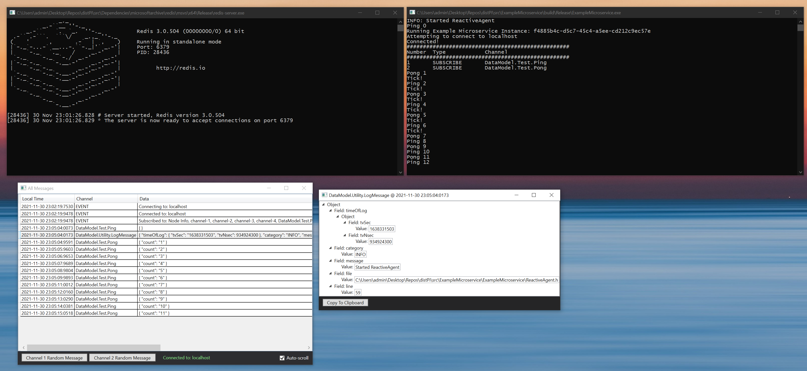

distPi
===================================================

Proof-of-concept distributed microservice architecture. Utilizing Redis for data-distribution, and Protobuf for modeling data-flow.  This stack was chosen for easy remote-monitoring, and portability between Windows and Linux.  Tested in Windows 10, and the Raspberry Pi OS.

Requirements for Windows 10
----------------------------
  * Visual Studio 2019 (with .NET 4.7, MSVC v142, and CMake)
	
Requirements for Linux
------------------------------
  * autoconf
  * automake
  * libtool
  * make
  * g++
  * unzip
  
Which, on Raspberry Pi OS, can be installed with:
> sudo apt-get install autoconf automake libtool curl make g++ unzip

Usage
------------------------------
1. Depending on the OS, run the corresponding ___Pull___ script to obtain the dependencies.  
2. Run the corresponding ___Build___ script.  You will need to append the ___CheckEnv___ script if you have installed VS2019 in a custom location.  
3. Run the ___Start___ scripts to spin up the various components. 
    - ___StartRedis___: Runs the Redis service 
    - ___StartViewer___: Runs the ChronologicalMessageWindow to observe the messages flowing back-and-forth
	- ___StartMicroService___: Runs the "Ping-Pong" messaging example
- ***Note***: By default, the start scripts are configured to connect to a Redis service that is running on localhost.  If Redis is running remotely, ensure that port 6379 is open, and replace 'localhost' with the destination IP address. 

4. Run the ___Deploy___ script to collect the binaries and ___Start___ scripts.  